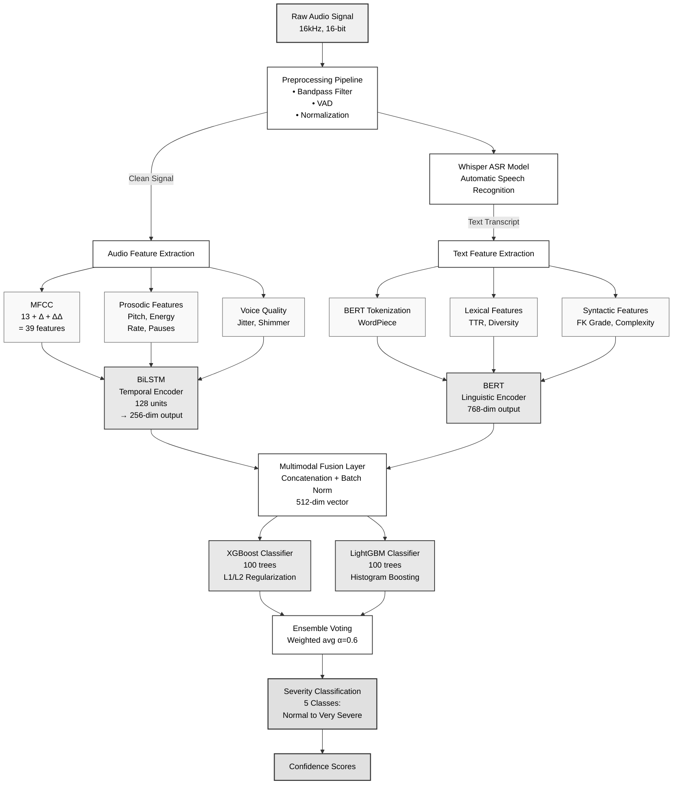

# Multimodal Aphasia Detection System - Architecture

## Component Legend

- **Input**: Raw audio signal (16kHz, 16-bit)
- **Processing**: Preprocessing and feature extraction pipelines
- **Features**: Extracted acoustic and linguistic features
- **Models**: Deep learning encoders and ensemble classifiers
- **Output**: Classification results and confidence scores

## Architecture Overview

This multimodal system combines:

1. **Audio Stream**: MFCC, prosodic, and voice quality features → BiLSTM encoder
2. **Text Stream**: BERT tokenization, lexical, and syntactic features → BERT encoder
3. **Fusion**: Concatenation of both streams into unified representation
4. **Ensemble**: XGBoost + LightGBM with weighted voting
5. **Output**: 5-level severity classification with confidence scores

## Key Features

- **Multimodal**: Leverages both audio and text information
- **Deep Learning**: BiLSTM for temporal patterns, BERT for linguistic understanding
- **Ensemble**: Combines XGBoost and LightGBM for robust predictions
- **Real-time**: Optimized for production deployment

## Stage Details

### Stage 1: Preprocessing
- **Bandpass Filter**: 80-8000 Hz to remove noise
- **VAD**: Voice Activity Detection for segment extraction
- **Normalization**: Peak normalization to standardize amplitude

### Stage 2: Feature Extraction
**Audio Features (256-dim):**
- MFCC: 13 coefficients + delta + delta-delta = 39 features
- Prosodic: pitch (F0), energy, speaking rate, pause statistics
- Voice quality: jitter, shimmer, HNR

**Text Features (from Whisper ASR):**
- BERT tokenization with WordPiece
- Lexical: TTR, word diversity, vocabulary richness
- Syntactic: Flesch-Kincaid grade, sentence complexity

### Stage 3: Deep Learning Encoders
- **BiLSTM**: 128 hidden units, bidirectional, outputs 256-dim temporal representation
- **BERT**: Pre-trained base model, outputs 768-dim linguistic representation

### Stage 4: Ensemble Classification
- **Fusion**: Concatenate audio + text features → 1024-dim vector
- **XGBoost**: 100 trees, L1/L2 regularization for sparsity
- **LightGBM**: 100 trees, histogram-based boosting for speed
- **Voting**: Weighted average with α=0.6 favoring XGBoost

### Stage 5: Output
- **5 severity classes**: Normal, Mild, Moderate, Severe, Very Severe
- **Confidence scores**: Per-class probabilities for interpretability
