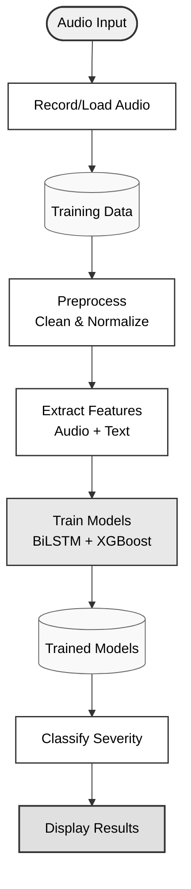

# Aphasia Detection System - Flow Diagram

## System Overview



## Pipeline Stages

### 1. Record/Load Audio
- **Input**: Microphone recording or audio file
- **Tools**: `gui_trainer.py`, `sample_generator.py`
- **Output**: WAV files (16kHz, 16-bit) in `training_data/`

### 2. Preprocess
- **Operations**: 
  - Bandpass filtering (80-8000 Hz)
  - Voice Activity Detection (VAD)
  - Peak normalization
- **Output**: Clean audio ready for analysis

### 3. Extract Features
- **Audio Features**: 
  - MFCC (13 coefficients + Δ + ΔΔ = 39 features)
  - Prosodic features (pitch, energy, rate, pauses)
  - Voice quality (jitter, shimmer, HNR)
- **Text Features**: 
  - Whisper ASR transcription
  - BERT tokenization
  - Lexical and syntactic analysis
- **Output**: Combined 1024-dimensional feature vector

### 4. Train Models
- **BiLSTM**: Temporal sequence modeling (128 units → 256-dim output)
- **BERT**: Linguistic understanding (768-dim output)
- **XGBoost + LightGBM**: Ensemble classification
- **Output**: Trained model files

### 5. Classify Severity
- **Process**: 
  - Load trained models
  - Extract features from new audio
  - Predict severity level (0-4)
- **Output**: Classification + confidence scores

### 6. Display Results
- **Information**:
  - Severity level (Normal, Mild, Moderate, Severe, Very Severe)
  - Confidence scores per class
  - Feature importance visualization
- **Format**: Console output + evaluation report

## Quick Reference

| Component | Script | Purpose |
|-----------|--------|---------|
| **Recording** | `gui_trainer.py` | Capture audio with severity labels |
| **Generation** | `sample_generator.py` | Create synthetic samples |
| **Training** | `train_model.py` | Build ML models |
| **Prediction** | `predict.py` | Classify new audio |
| **Evaluation** | `evaluate_model.py` | Assess model performance |

## Data Flow Summary

```
Audio (16kHz WAV) 
  ↓
Preprocessing (Clean, Normalize, VAD)
  ↓
Feature Extraction (Audio: 256-dim, Text: 768-dim)
  ↓
Model Training (BiLSTM + BERT + Ensemble)
  ↓
Classification (5 severity levels)
  ↓
Results (Label + Confidence)
```

## Severity Levels

- **0**: Normal speech - Fluent, coherent, no impairment
- **1**: Mild aphasia - Slight word-finding difficulties
- **2**: Moderate aphasia - Noticeable speech disruption
- **3**: Severe aphasia - Very limited speech production
- **4**: Very severe aphasia - Minimal intelligible speech
